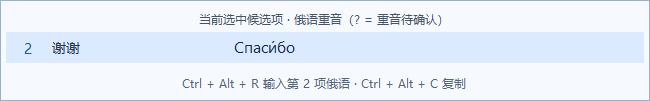
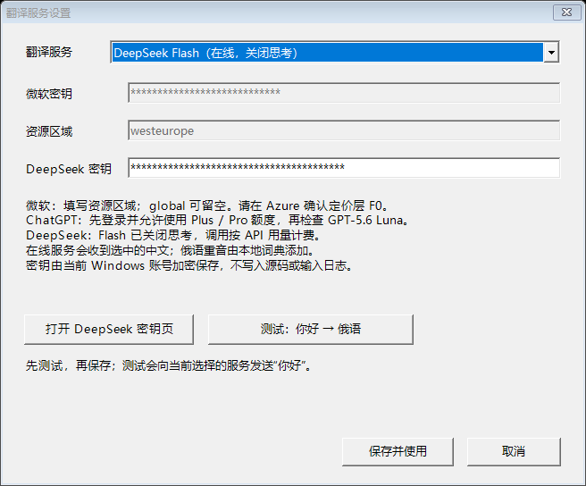
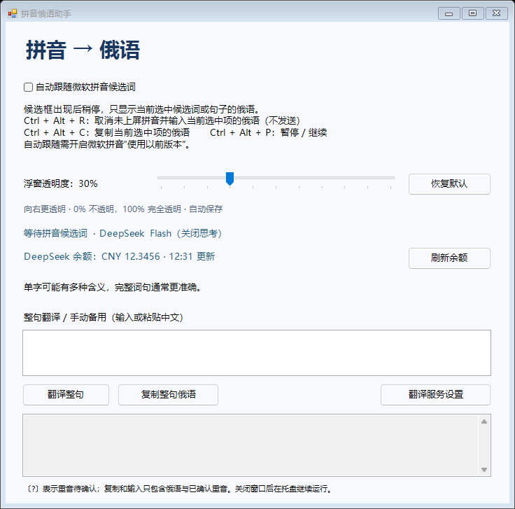
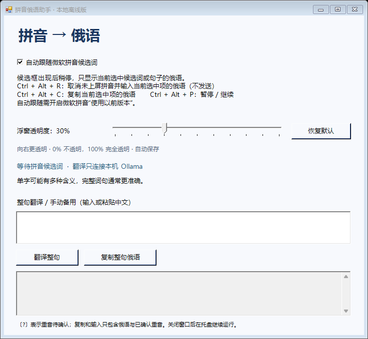

# 拼音俄语助手 / Pinyin Russian

Windows 微软拼音输入法的俄语翻译伴侣。输入拼音后，在候选框旁显示**当前选中词或句子**的俄语，并支持快捷键直接输入俄语。



上图为程序的模拟候选项排版验证，展示第 2 项“谢谢”的译文与重音。

## 下载与启动

1. 在 [Releases](https://github.com/zhaokangxin4-droid/pinyin-russian/releases/latest) 下载 `PinyinRussian-v1.1.0-win-x64.zip`，完整解压。
2. 选择翻译方式。在线翻译无需安装 Ollama：启动程序后打开“翻译服务设置”，选择服务、完成密钥或订阅授权配置并测试，再保存。若使用默认的本地翻译，在 Windows 64 位系统安装并运行 [Ollama](https://ollama.com/download/windows)，下载模型：

   ```powershell
   ollama pull translategemma:4b
   ```

3. 打开 Windows 设置 → 时间和语言 → 语言和区域 → 微软拼音 → 常规 → 兼容性，开启“使用以前版本的微软拼音输入法”。如果刚修改，重新打开要输入文字的软件。
4. 双击解压目录中的 `PinyinRussian.exe`，在中文模式下输入拼音，稍停后查看俄语浮窗。

`PinyinRussian.exe`、`Interop.UIAutomationClient.dll` 和 `data` 文件夹必须保存在一起。程序使用 Windows 的 .NET Framework，不需要 Python。本地模式不需要 API 密钥，模型需单独下载；在线模式需要自己的密钥或授权，安装包不含模型权重、密钥或登录凭据。

## 翻译服务

| 服务 | 配置 | 翻译文字的去向 |
| --- | --- | --- |
| DeepSeek Flash | 自己的 DeepSeek API 密钥，按 API 用量计费；固定 `deepseek-flash`，关闭思考 | DeepSeek 官方 HTTPS 接口 |
| 微软 Translator | Azure Translator 资源、密钥和区域；自行确认所选套餐 | 微软官方 HTTPS 接口 |
| ChatGPT 订阅 | 在浏览器登录并授权，账号需有 GPT-5.6 Luna 调用资格和可用额度 | OpenAI 官方 HTTPS 接口 |
| 本地 Ollama | 安装 Ollama，下载 `translategemma:4b` | 本机 `127.0.0.1:11434` |

DeepSeek 接入：打开“翻译服务设置”，选择 DeepSeek、填入密钥并测试“你好 → 俄语”，再保存。也可以运行 `PinyinRussian.exe --deepseek-settings`，点击“测试并启用 DeepSeek”后自动保存并切换。服务出错时显示原因，不会自动调用其他服务。



上图使用模拟凭据验证界面，未包含真实密钥。详细配置步骤见 [使用说明](使用说明.md)。

选择 DeepSeek 后，主窗口会查询官方账户余额，显示币种、总余额和更新时间。“刷新余额”立即查询；窗口显示期间每 5 分钟自动更新，鼠标悬停可查看赠金及充值余额。查询失败时标明旧余额，不把失败当作余额为零。余额只在内存和界面中显示，不保存到文件。



## 功能

- 只翻译当前选中的候选词或句子；切换选中项时自动更新，不批量翻译整页。
- 主窗口可用滑块直接调整浮窗透明度（0%—100%），立即生效并自动保存；默认 30% 透明，可一键恢复。浮窗避开拼音行和候选提示栏，鼠标可穿透且不抢焦点。
- RUAccent 本地词典为俄语标注重音，如 `Спаси́бо`、`Здра́вствуйте`。
- `Ctrl + Alt + R`：取消尚未上屏的拼音，把当前选中项的俄语写入输入框。不会按回车或发送消息。
- `Ctrl + Alt + C`：复制当前选中项的俄语。
- `Ctrl + Alt + P`：暂停或继续自动翻译。
- 主窗口支持手动整句翻译；关闭窗口后在系统托盘继续运行。
- 最近 512 条译文缓存在内存中，重复选择立即显示；切换服务清空缓存。本地模型最后一次调用后保留 1 小时。

同形异音词、е/ё 歧义词和未收录的多音节词不猜测重音，显示 `〔?〕`。这个提示仅用于显示，不会写入或复制到目标输入框。翻译准确性依赖上下文，单字、多义词和语气词可能不准确。

更多操作与限制见 [使用说明](使用说明.md)。

## 调整浮窗透明度

双击系统托盘里的助手图标，在主窗口拖动“浮窗透明度”滑块。0% 表示不透明，100% 表示完全透明；“恢复默认”回到 30% 透明。拖动立即生效，设置自动保存在程序旁的 `settings.json`，重启后保留。主窗口始终可见，随时可以调回浮窗透明度。



升级已有安装时，先从托盘退出助手，再将新版解压文件复制到原程序目录，保留原有 `settings.json`、`settings.translation.json` 和 `settings.chatgpt.dat`。新版下载包不包含个人设置。云端密钥和登录凭据只能由保存时的 Windows 用户解密，换电脑或账号时需重新配置。

## 数据与密钥

默认使用本机 Ollama 的 [`translategemma:4b`](https://ollama.com/library/translategemma:4b)，请求只发往 `http://127.0.0.1:11434/api/chat`。选择在线服务后，当前选中候选项或手动提交的整句通过 HTTPS 发送给所选服务，俄语重音仍由本地词典处理。

助手不把输入文字或令牌写入日志，翻译缓存只在内存中。DeepSeek 与微软密钥分别由 Windows 当前用户加密保存在 `settings.translation.json`，ChatGPT 凭据保存在 `settings.chatgpt.dat`。这些文件、临时副本和登录状态记录都被 Git 忽略，发布脚本只打包明确列出的公共文件。请勿分享自己的安装目录或凭据文件；下载者需自行配置自己的服务。

本项目是 Windows 桌面程序。GitHub 提供源码与安装包下载，网页本身不接管输入法。

## 从源码编译

仓库包含 C# 源码、编译脚本和 UI Automation 的 COM 互操作程序集生成器。重音词典的二进制文件超过普通 Git 单文件大小限制，因此随 Release 安装包分发，不放进 Git 历史。

将 Release 安装包内的 `data/russian-stress.bin` 与 `data/russian-stress-ambiguous.txt` 复制到本仓库的 `data` 文件夹，再执行：

```powershell
powershell -NoProfile -ExecutionPolicy Bypass -File .\build.ps1
```

编译脚本使用 Windows 自带的 .NET Framework 64 位 C# 编译器，并在缺少 COM 互操作程序集时从系统的 `UIAutomationCore.dll` 自动生成。输出为根目录下的 `PinyinRussian.exe` 和 `Interop.UIAutomationClient.dll`；生成器源码保存在 `tools/ImportUIAutomation.cs`。

也可以按固定的上游版本自行生成词典，见 [词典构建说明](scripts/README.md)。

词典文件准备完成后，可用 `powershell -NoProfile -ExecutionPolicy Bypass -File .\scripts\package-release.ps1 -Version 1.1.0` 生成 Windows ZIP 和 `SHA256SUMS.txt`。脚本使用固定文件清单，不会包含本机的设置、密钥或登录记录。

## 验证与兼容性

微软拼音候选框识别、浮窗显示及俄语输入快捷键曾在 Codex 的真实键盘输入中确认。当前选中项模式另外检查了单项请求、选中项切换、旧响应丢弃、候选框关闭、缓存复用、重音保留和屏幕边界。

在线服务的请求、错误、流式完成、缓存与凭据保存经过模拟检查；ChatGPT GPT-5.6 Luna 和 DeepSeek Flash 已完成短句联网试译，微软 Translator 尚未完成真实资源试译。DeepSeek 两次短句示例约 1.0—1.3 秒，仅为一次网络环境下的样本，不代表稳定速度或长句准确率。

不同软件的输入控件可能有兼容性差异；以管理员权限运行的目标软件可能拒绝普通权限助手的输入。快捷键被其他软件占用时，主窗口会提示。

## 第三方来源

重音词典数据的固定版本、处理方式与 MIT 许可见 [data/来源.md](data/来源.md) 和 [data/RUAccent-LICENSE.txt](data/RUAccent-LICENSE.txt)。Ollama 与 TranslateGemma 由用户自行安装，各自遵循其上游许可；仓库和安装包不包含模型权重。
